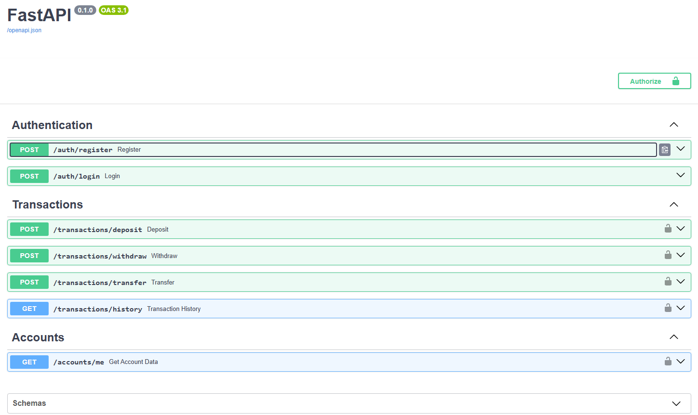

# API Bancária Assíncrona com FastAPI

API RESTful assíncrona desenvolvida com FastAPI para simulação de operações bancárias.

O projeto foi desenvolvido como desafio do bootcamp da DIO e a Luizalabs com foco em autenticação JWT, operações financeiras e arquitetura backend organizada utilizando boas práticas.

---

# Funcionalidades

- Cadastro de usuários
- Login com autenticação JWT
- Depósitos
- Saques
- Transferências entre contas via CPF
- Consulta de histórico de transações
- Consulta de dados da conta
- Validação de saldo
- Rotas protegidas com autenticação
- Documentação automática com Swagger/OpenAPI

---

# Tecnologias Utilizadas

- Python 3.13
- FastAPI
- SQLAlchemy 2.0
- SQLite
- Alembic
- Pydantic
- JWT Authentication
- Passlib
- Poetry

---

# Arquitetura

O projeto foi estruturado seguindo separação de responsabilidades:

- **Routes** → endpoints da API
- **Services** → regras de negócio
- **Schemas** → validações e serialização
- **Models** → entidades ORM
- **Core** → autenticação e segurança
- **Database** → conexão e dependências do banco

---

# Estrutura do Projeto

```bash
app/
├── core/         # Segurança e autenticação
├── database/     # Conexão e dependências do banco
├── models/       # Modelos ORM
├── routes/       # Endpoints da API
├── schemas/      # Validações e serialização
├── services/     # Regras de negócio
└── main.py       # Inicialização da aplicação
```

---

# Endpoints

## Autenticação

### Registrar usuário

`POST /auth/register`

### Login

`POST /auth/login`

Retorna um token JWT utilizado para autenticação das rotas protegidas.

---

## Transações

### Depósito

`POST /transactions/deposit`

### Saque

`POST /transactions/withdraw`

### Transferência

`POST /transactions/transfer`

### Histórico de transações

`GET /transactions/history`

---

## Conta

### Dados da conta

`GET /accounts/me`

---

# Regras de Negócio

- Não é permitido realizar depósitos negativos
- Não é permitido realizar saques negativos
- O usuário deve possuir saldo suficiente para saque e transferência
- Apenas usuários autenticados podem acessar rotas protegidas

---

# Diferenciais do Projeto

- Arquitetura organizada em camadas
- Operações assíncronas com SQLAlchemy Async
- Transferências entre usuários via CPF
- Proteção de rotas com JWT
- Documentação automática com Swagger
- Migrations com Alembic

---

# Variáveis de Ambiente

Crie um arquivo `.env` na raiz do projeto baseado no `.env.example`.

---

# Como Executar o Projeto

## Clone o repositório

```bash
git clone https://github.com/GalvanGabe/API-Bancaria-Assincrona-com-FastAPI.git
```

## Acesse o diretório

```bash
cd API-Bancaria-Assincrona-com-FastAPI
```

## Instale as dependências

```bash
poetry install
```

## Execute as migrations

```bash
poetry run alembic upgrade head
```

## Inicie a aplicação

```bash
poetry run uvicorn app.main:app --reload
```

---

# Documentação da API

Após iniciar a aplicação:

## Swagger UI

`http://127.0.0.1:8000/docs`

## ReDoc

`http://127.0.0.1:8000/redoc`

---

# Swagger UI



---

# Autenticação

A API utiliza autenticação JWT Bearer Token.

Após realizar login em `/auth/login`, utilize o token retornado para acessar os endpoints protegidos.

No Swagger, clique em **Authorize** e informe apenas o token JWT.

---

# Aprendizados

Durante o desenvolvimento deste projeto foram aplicados conceitos como:

- APIs RESTful
- Programação assíncrona
- JWT Authentication
- SQLAlchemy Async ORM
- Relacionamentos entre tabelas
- Arquitetura em camadas
- Migrations com Alembic
- Validação de dados com Pydantic
- Dependency Injection com FastAPI

---

# Autor

Gabriel Galvan
